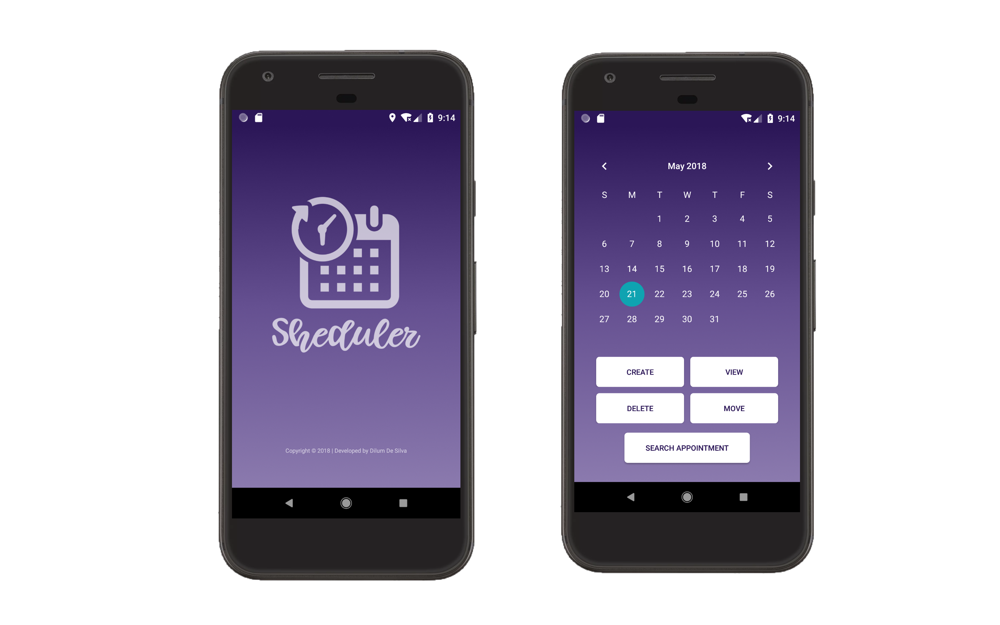
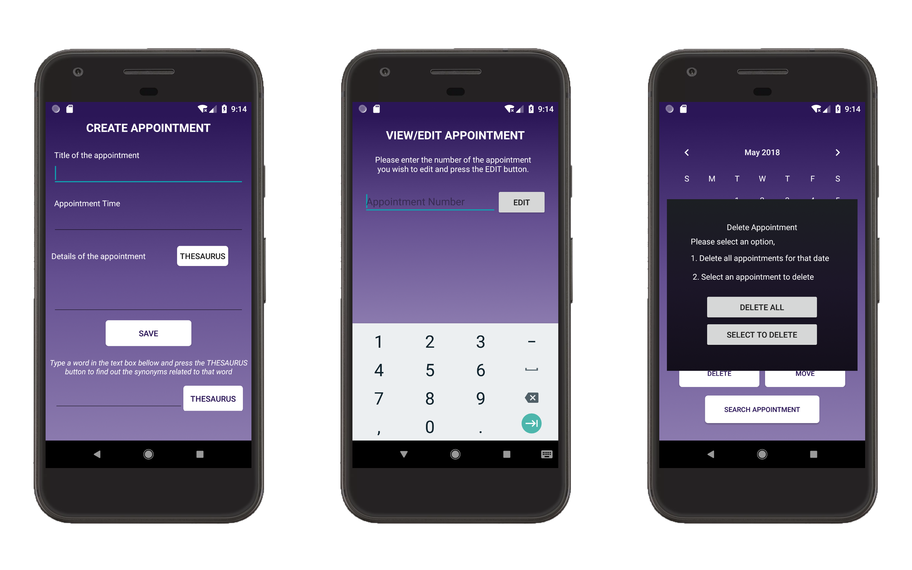

# Scheduler-2.2
A android based appointment management application, which the user will be using to create appointments with full details describing what is involved in each appointment

## Technology behind Scheduler-2.2

1. Development IDE - Android Studio 3.0.1
2. Main development language - Java & XML
3. SQLite Database
4. Teted AVD s - Google Pixel / Nexus 5X
5. Tested API Level - API 26 / API 27

## Main Screens of Scheduler-2.2 Game

Following picture is showing the main screens of this **Scheduler-2.2** game.

The first screen shows the **splash screen** of my game and I added a logo and a some faded animation to make it looks better. Second screen presents the user with **a calendar** displaying the dates of the current month and year and 5 buttons labelled **Create Appointment, View/Edit Appointments, Delete Appointment, Move Appointment, Search.** and also The user can select a day by clicking on the corresponding date of the calendar. The user can select a different month or year by using the displayed calendar.

For further user can perform following tasks using the main app screen(Second Screen).

* Clicking on the **Create Appointment button** (After the user selects a date, ) displays the user with 3 textboxes and a Save button. The 3 textboxes will prompt the user to enter three separate things.
  * The title of the appointment event (e.g. Meeting with John), 
  * The time of the event.
  * The details of the appointment (e.g. we are going to discuss, this and that and that...).

  Pressing the Save button will save the title and details of the appointment in an SQLite table and also the app allows users to create any number of appointments for a single date (App does not allow to create appoinments with the same tittle on a same day but Two appointments with the same title are allowed if they occur on different dates). 
  
* Clicking on the **Delete Appointment button** displays the user with 2 options as buttons.
  * Delete all appointments for that date button - which will delete from the database all the corresponding appointments.
  * Select appointment to delete button - which will display all of the appointments.
  
* Clicking on the **View/Edit Appointment button** displays the user with all appointments of that date and allows him/her to edit all the details of a chosen appointment (time, title, details). All the updated information is persisted in the database.

* Clicking on the **Move Appointment button** displays the user with all appointments for that date, asking him/her to select a specific appointment. Then the application allows the user to select another date from a calendar view, in which case the appointment is transferred automatically to the newly selected date (the database is updated accordingly).

* Clicking on the Search button of the initial screen will be used by the user in order to retrieve ap- pointments for which he/she does not remember the date. Clicking on the button will ask the user to enter a string used for the search. The application will search all future appointments and try to match the entered string with the title and details of any ap- pointment(s). The matched appointment(s) will be displayed to the user and he/she will be able to select one of them to see the full details of it.

